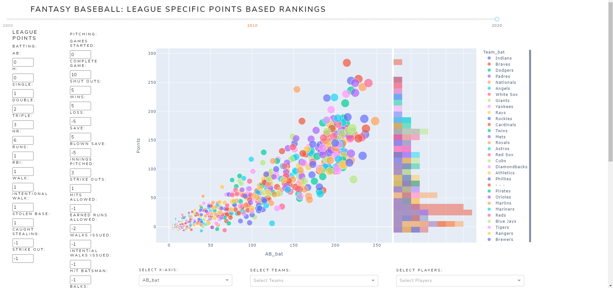
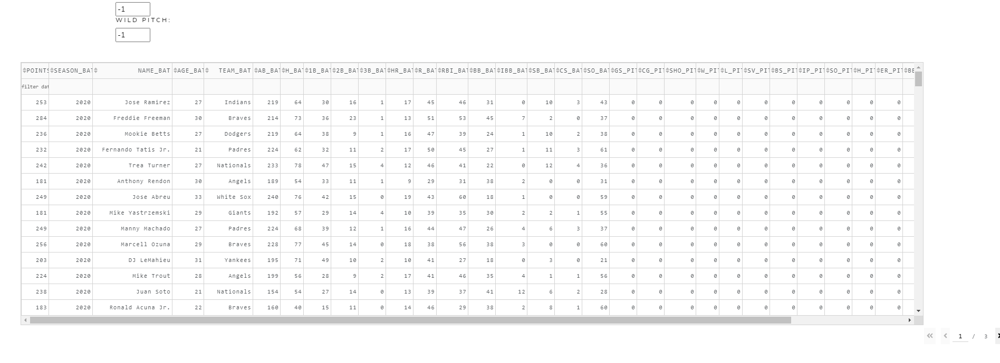

# PointsDashboard
Using the Pybaseball-database to create a Points based ranking dashboard that is adjustable to any scoring format.

The app uses the Python pybaseball package to pull data that was done in a previous project.

All_Stats.csv file was pulled from my pybaseball database project:

https://github.com/ttaylor14/pybaseball-database

This data was then cleaned to only include the past 20 years.

and Active Link of the current app can be found here:

## https://mlb-points-rankings.herokuapp.com/

Future additions include:

[ ] - Marcel Projection Models

[ ] - Player Regression Graphing

[ ] - Player Position appearances

[ ] - player value above replacement based on league and team size

## Contributing
Pull requests are welcome. For changes, please open an issue first to discuss what you would like to change or add.

## License
[MIT](https://choosealicense.com/licenses/mit/)
